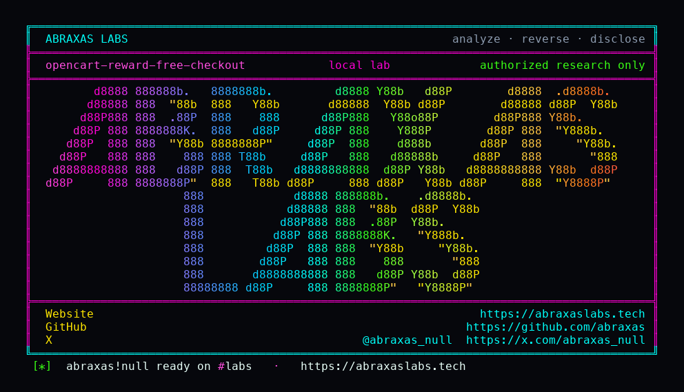

<p align="center">
  
</p>

<p align="center">
  <a href="https://abraxaslabs.tech"><strong>abraxaslabs.tech</strong></a>
  &nbsp;·&nbsp;
  <a href="https://github.com/abraxas">github.com/abraxas</a>
  &nbsp;·&nbsp;
  <a href="https://x.com/abraxas_null">@abraxas_null</a>
  &nbsp;·&nbsp;
  <a href="mailto:abraxas.null@proton.me">abraxas.null@proton.me</a>
  &nbsp;·&nbsp;
  <a href="https://github.com/abraxas/opencart-reward-free-checkout">opencart-reward-free-checkout</a>
</p>

# opencart-reward-free-checkout

**OpenCart** `4.1.0.4` - OpenCart Ltd

[CVE-2025-15116](https://www.cve.org/CVERecord?id=CVE-2025-15116) was a coupon race through 4.1.0.3. On 4.1.0.4, [`coupon.save`](https://github.com/opencart/opencart/blob/4.1.0.4/upload/extension/opencart/catalog/controller/checkout/coupon.php) unsets `payment_method` when the coupon changes. [`reward.save`](https://github.com/opencart/opencart/blob/4.1.0.4/upload/extension/opencart/catalog/controller/checkout/reward.php) does not. Apply enough points that `getTotals` is `<= 0.00`, pick Free Checkout, then clear the points. Confirm rewrites the pending row to catalog price. `free_checkout.confirm` only checks the session payment code.

**A logged-in customer with reward points can ship a catalog SKU as Free Checkout and keep the points.**

| | |
|---|---|
| ID | no CVE yet |
| CWE | [CWE-840](https://cwe.mitre.org/data/definitions/840.html), [CWE-863](https://cwe.mitre.org/data/definitions/863.html) |
| CVSS | **High: 6.5** `CVSS:3.1/AV:N/AC:L/PR:L/UI:N/S:U/C:N/I:H/A:N` |
| Product | [OpenCart](https://github.com/opencart/opencart) |
| Affected | through **4.1.0.4** reward + Free Checkout |
| Auth | authenticated customer (guest cart is not this bug) |
| License | [GNU Affero GPL v3.0](LICENSE) |
| Lab | `127.0.0.1` only |

## What an attacker can do

Log in, put a points-covered SKU in the cart, apply enough reward that Free Checkout lists, save that method, then `reward.save` with `0`. Second confirm writes catalog total. `free_checkout.confirm` promotes the order to paid. Points never debit.

They do not get a shell. Guest checkout is not this bug: reward needs a customer. Free Checkout only *lists* at `total <= 0`. The bug is that clearing points does not unlist it, and confirm does not look at the total again.

## How I found it

I read `reward.save`, then `coupon.save`, then `getMethods` (`total <= 0.00`), then `editOrder` while status is 0, then `free_checkout.confirm`. On 4.1.0.4, `reward=0` drops `session.reward`. It does not touch `payment_method`. Coupon after the 15116 hardening does.

The first client that looks at this will apply 100 points, pick Free Checkout, confirm once, and get an honest zero-total order. That is the feature, not the bug.

Wrong turns already recorded: `coupon.save` instead of `reward.save` (that path unsets the method); guest checkout; product with `points=0` (Free Checkout never lists); leaving `reward` in session through `free_checkout.confirm` (honest free order, points should debit); looking at `order_status_id=0` only (pending is not paid). The oracle is **status 1, total 100.00, payment free_checkout, debit 0**.

Lab: customer login. Cart add 36 (iPod Nano, `points=100`). `reward.save` 100. Payment methods list Free Checkout. Save it. Confirm writes order 3 at 0. `reward.save` 0. Confirm rewrites order 4 at 100.00. `free_checkout.confirm`. Seed drops tax and shipping so reward can zero `getTotals` exactly. That is not the bug. A catalog SKU whose points cover the line is the realistic case. Customer still has the 1000.

## Lab

```bash
cd lab
./run.sh
```

Target **only** `http://127.0.0.1:18108`. Place OpenCart 4.1.0.4 `upload/` at `lab/www` first. That tree is not in this repo.

```text
SUCCESS OpenCart reward + Free Checkout underpay
IOC order-after-reward 3 total=0.0000 status=0 free_checkout.free_checkout
IOC order-after-clear 4 total=100.0000 status=0 free_checkout.free_checkout
IOC free_checkout.confirm redirect checkout/success
IOC order-final 4 total=100.0000 status=1 debit=0 balance=1000
```

## The fix

`unset` `payment_method` in `reward.save` the way `coupon.save` already does, and make `free_checkout.confirm` refuse `total > 0`.

## References

- [github.com/opencart/opencart](https://github.com/opencart/opencart) tag [4.1.0.4](https://github.com/opencart/opencart/releases/tag/4.1.0.4)
- [`reward.php`](https://github.com/opencart/opencart/blob/4.1.0.4/upload/extension/opencart/catalog/controller/checkout/reward.php) · [`coupon.php`](https://github.com/opencart/opencart/blob/4.1.0.4/upload/extension/opencart/catalog/controller/checkout/coupon.php) · [`free_checkout.php` controller](https://github.com/opencart/opencart/blob/4.1.0.4/upload/extension/opencart/catalog/controller/payment/free_checkout.php) · [`free_checkout.php` model](https://github.com/opencart/opencart/blob/4.1.0.4/upload/extension/opencart/catalog/model/payment/free_checkout.php) · [`confirm.php`](https://github.com/opencart/opencart/blob/4.1.0.4/upload/catalog/controller/checkout/confirm.php)
- Contrast: [CVE-2025-15116](https://www.cve.org/CVERecord?id=CVE-2025-15116)
- [CWE-840](https://cwe.mitre.org/data/definitions/840.html) · [CWE-863](https://cwe.mitre.org/data/definitions/863.html)

## License

GNU Affero GPL v3.0. See [LICENSE](LICENSE). Loopback lab only. No warranty.
